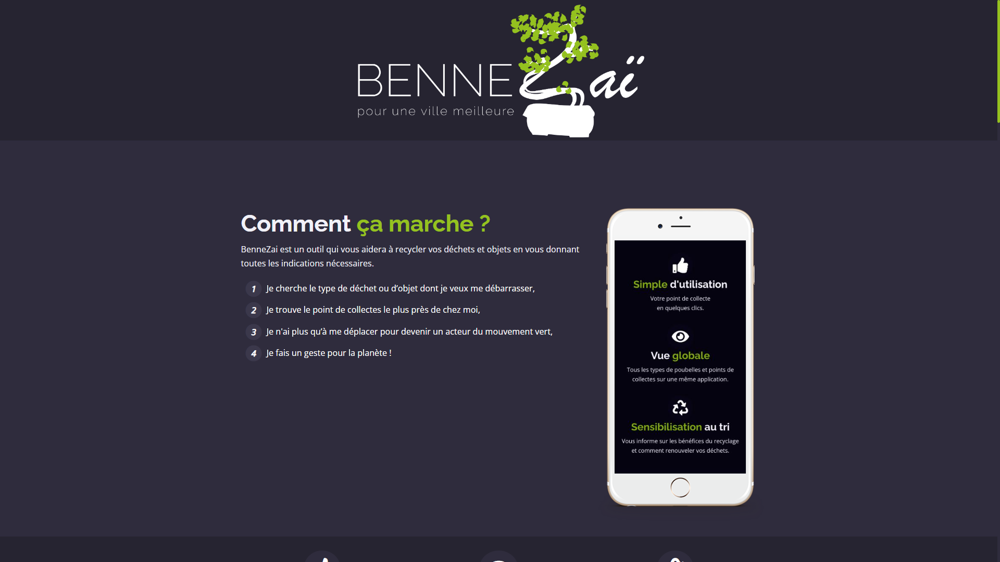
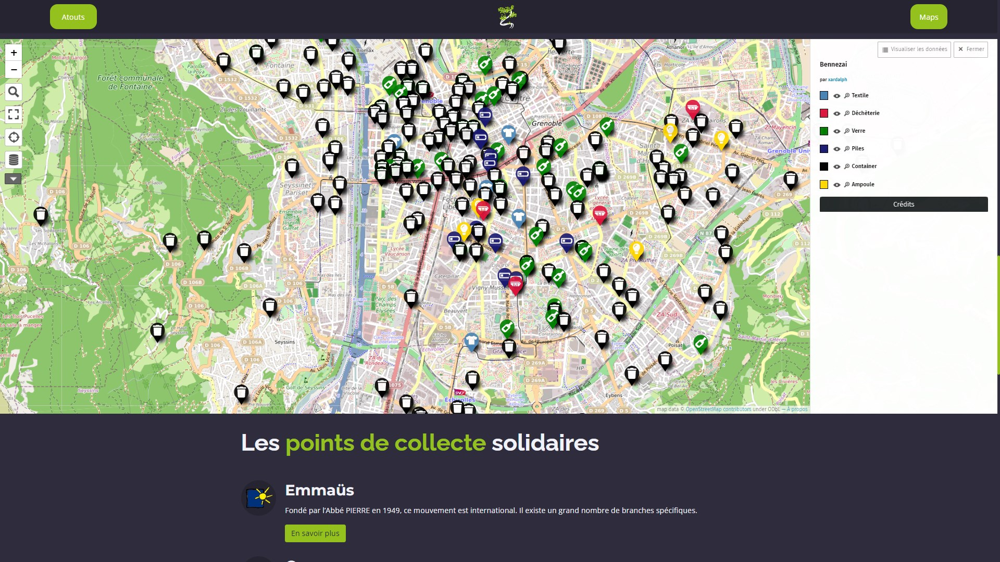
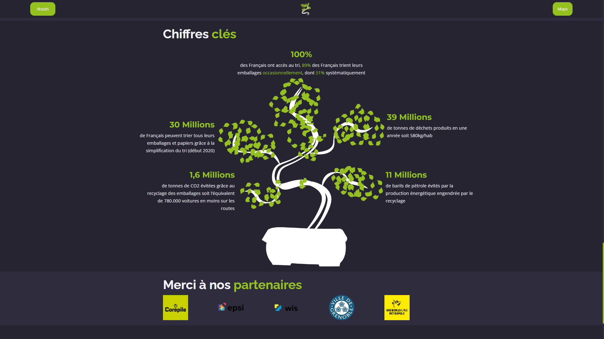
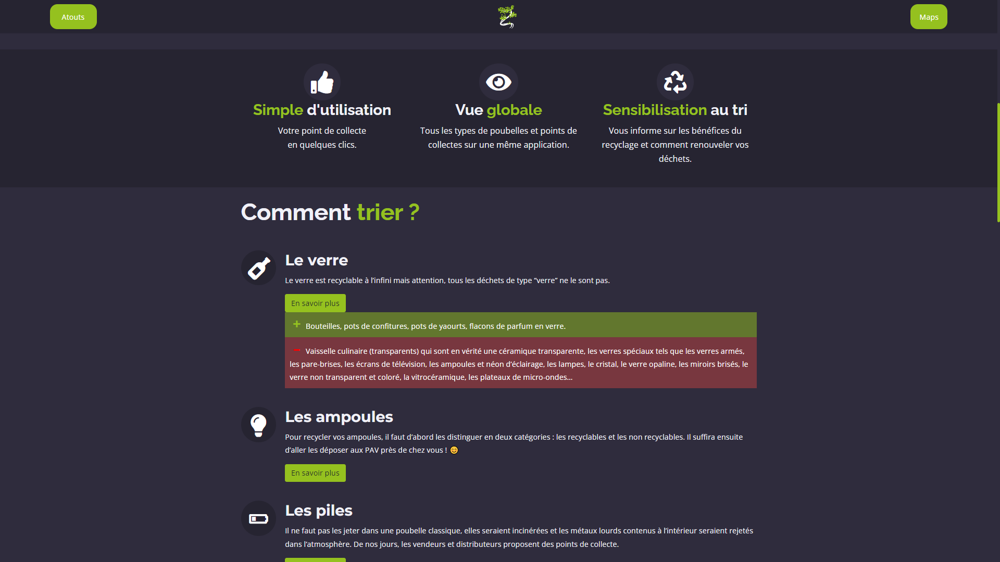

# BenneZaï

Benne Zaï, est un projet qui a vu le jour en novembre 2020, autour d'un projet étudiant regroupant des étudiants web marketings et d'autres en ingénieries informatiques. 
Notre groupe a choisie de mettre en place ce projet pour sensibiliser les personnes vers le recyclage et le tri, ce qui est important dans notre société actuelle, d'autant plus pour la renommée de Grenoble en tant que Capitale Verte Européenne.

## Résultat
### Accueil

---
### Affichage d'une carte interactive 

---
### Visuels avec chiffres clés

---
### Panneaux indiquants les éléments recyclabes ou non

> Vivien Frébourg
